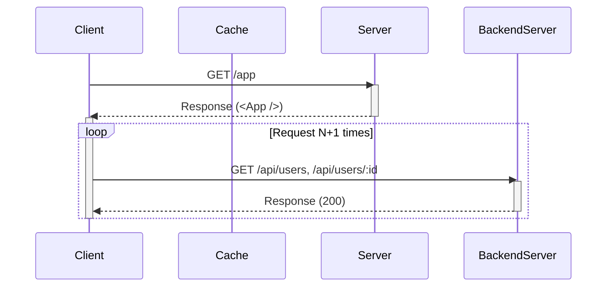
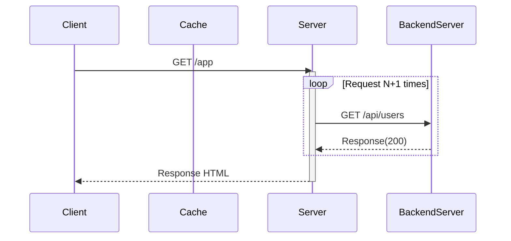
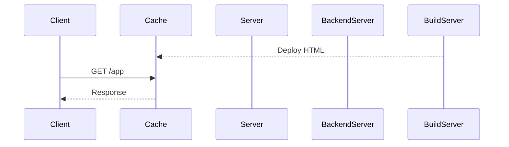
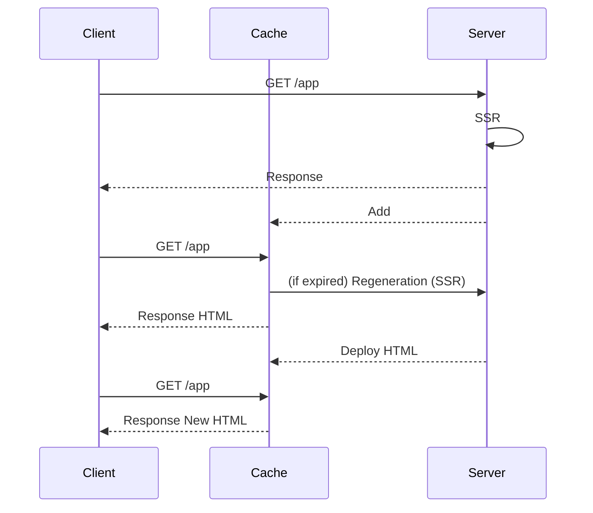

---
# try also 'default' to start simple
theme: seriph
# random image from a curated Unsplash collection by Anthony
# like them? see https://unsplash.com/collections/94734566/slidev
background: https://source.unsplash.com/collection/94734566/1920x1080
# apply any windi css classes to the current slide
class: 'text-center'
# https://sli.dev/custom/highlighters.html
highlighter: shiki
# show line numbers in code blocks
lineNumbers: false
# some information about the slides, markdown enabled
info: |
  ## Slidev Starter Template
  Presentation slides for developers.

  Learn more at [Sli.dev](https://sli.dev)
# persist drawings in exports and build
drawings:
  persist: false
# use UnoCSS
css: unocss
---

# Next.js事始め

---

# Next.js?

* Vercel社が開発しているReact Framework
  * Vercel社: PaaSサービスを提供する会社
* React公式ドキュメントではSSR向けフレームワークと紹介されている
  * https://reactjs.org/docs/create-a-new-react-app.html
  * > If you’re building a server-rendered website with Node.js, try Next.js.
* 利用企業: GitHub, Netflix, Nintendo,...


---
layout: two-cols
---
# State of JS 2022

### Retension
> **would use again** / (**would use again** + **would not use again**)


[State of JS 2022 - Back-end Frameworks](https://2021.stateofjs.com/en-US/libraries/back-end-frameworks/)

::right::

# _

### Usages
> (**would use again** + **would not use again**) / **total**


---
layout: intro
---

# Getting Started

---
layout: two-cols
---

# Next.js - Getting Started

```bash
$ npx create-next-app@latest
$ npm run dev
-> Access to http://localhost:3000
```

::right:: 


---

# Next.js - Directory Structure

```
(ROOT)/
├─ node_modules/
├─ pages/           <- Page components
│  ├─ api/
│  │  └─ hello.js
│  ├─ _app.js
│  └─ index.js
├─ public/          <- Static files (can access from base url. e.g.: '/*')
├─ styles/          <- Stylesheet (.css, .module.css, .scss)
├─ next.config.js
├─ package.json
├─ ...
```

`pages` は Next 13 から `app` に変わったらしい

---

# file-system based router

[https://nextjs.org/docs/routing/introduction](https://nextjs.org/docs/routing/introduction)

> Next.js has a file-system based router built on the [concept of pages](https://nextjs.org/docs/basic-features/pages).
> 
> 
> When a file is added to the `pages` directory, it's automatically available as a route.

```
(ROOT)/
├─ pages/
│  ├─ _app.js
│  ├─ index.js      -> http://localhost:3000/
│  ├─ about.js      -> http://localhost:3000/about
│  ├─ posts/
│  │  ├─ index.js   -> http://localhost:3000/posts
│  │  └─ [slug].js  -> http://localhost:3000/posts/:slug
│  └─ api/
│     └─ hello.js   -> http://localhost:3000/api/hello
...
```

`index.js` は Next 13 から `page.js` に変わったらしい

---
layout: two-cols
---

# Pages (Base)


```bash{3}
(ROOT)/
├─ pages/
│  ├─ about.js      -> http://localhost:3000/about
```

**pages/about.js**

```ts
export default function About() {
    return (
        <p>Hello, World.</p>
    )
}
```

::right::


---
layout: two-cols
---

# Pages (Nested)

```bash{4}
(ROOT))/
├─ pages/
│  ├─ posts/
│  │  ├─ index.js   -> http://localhost:3000/posts
```

**pages/posts/index.js**

```ts
import Link from 'next/link'

export default function Posts() {
    return (
        <div>
            <ul>
            <li><Link href="/posts/first">first</Link></li>
            <li><Link href="/posts/second">second</Link></li>
            </ul>
        </div>
    )
}
```

::right::


---
layout: two-cols
---

# Pages (Dynamic Route)


```bash{4}
(ROOT)/
├─ pages/
│  ├─ posts/
│  │  └─ [slug].js  -> http://localhost:3000/posts/:slug
```

**pages/posts/[slug].js**
```ts
import { useRouter } from 'next/router';

export default function Post () {
    const router = useRouter()
    const { slug } = router.query
    return (
        <p>Post: {slug}</p>
    )
}
```

::right::


---
layout: two-cols
---

# Pages (API)

```bash{4}
(ROOT))/
├─ pages/
│  └─ api/
│     └─ hello.js   -> http://localhost:3000/api/hello
```

**pages/api/hello.js**
```ts
export default function handler(req, res) {
  res.status(200).json({ name: 'John Doe' })
}
```

::right::


---
layout: intro
---

# CSR/SSR/SSG/ISR

---

# CSR/SSR/SSG/ISR

* 最近のフロントエンド界隈でよく見かける3文字集
  * **CSR**: Client Side Rendering
  * **SSR**: Server Side Rendering
  * **SSG**: Static Site Generation
  * **ISR**: Incremental Static Regeneration
* Next.jsは、もともとSSR用のフレームワークとして開発された (要出典)
* 現在、Next.jsでは、これら全てに対応できる

---

# CSR (Client Side Rendering)



### Cons
* ページの表示が遅い
  * 非力なClientでDOM構築を行う
  * データが必要な場合Fetchするが、サーバーと距離が離れている
* 初期ページは何も情報を持たないため、SEOに弱い


---

# SSR (Server Side Rendering)



### Pros
* ~~ページの表示が遅い~~
* ~~初期ページは何も情報を持たないため、SEOに弱い~~
  * → リクエストに対して **サーバー側** で動的にHTMLを生成して返却

### Cons
* リクエストのたびにHTMLを生成するため遅い
* キャッシュによる高速化もできない

---

# SSG (Static Site Genration)



### Pros
* ~~リクエストのたびにHTMLを生成するため遅い~~
* ~~キャッシュによる高速化もできない~~
  * → リクエストに対して事前に生成されたHTMLを返却
  * → 静的なデータのためキャッシュキャッシュ乗せることが出来る

### Cons
* ページ内容を動的に変更できない
* サイト全体を対象にビルドするため、ビルドにかかる時間が長い

---
layout: two-cols
---

# ISR (Incremental Static Regeneration)



::right::

### 流れ
* 初回: SSR
* 2回目以降: Cache
* 指定時間以降:
  * リクエストに対してはCacheから返却
  * ServerへページのRegenerationを指示
    * 次回以降はRegenerationしたページを返す

### Pros
* ~~ページ内容を動的に変更できない~~
  * → 一定期間ごとにページ内容の更新が可能
  * → ページ単位で再生成を実行できる

---

[RFC 5861: HTTP Cache\-Control Extensions for Stale Content](https://www.rfc-editor.org/rfc/rfc5861)
> 3.  The stale-while-revalidate Cache-Control Extension  . . . . . . 2

[stale\-while\-revalidate対応のCDNでISRのような挙動を実現する](https://zenn.dev/team_zenn/articles/0b601c1f62019b)
> Next.jsのISRはstale-while-revalidateというキャッシュコントロールの考え方に基づいています。これはキャッシュが古くなった後も、次のリクエストではとりあえず古いキャッシュを返し、裏で非同期にキャッシュを更新するという考え方です。

<span class="mt-8"></span>

> Vercelにデプロイする場合、ソースコード上で決められた書き方さえすれば、Vercel側の追加設定なしでISRを利用できます。
> しかし、Vercel以外のプラットフォームにデプロイするとなると途端に話がややこしくなります。


---
layout: image-right
image: /20221119_nextjs/nextjs-pagerendering.png
---

# Web Vitals

[Web Vitals](https://web.dev/i18n/ja/vitals/)
> Web Vitals は、Web 上での優れたユーザー エクスペリエンスの提供に欠かすことのできない品質シグナルに関する統一的なガイダンスの提供を目的とした、Google によるイニシアチブです。

* **TTFB** (Time To First Byte)
  * 1バイト目を受信するまでの時間
* **TBT** (Total Blocking Time)
* **TTI** (Time To Interactive)
  * ユーザーが操作可能になるまでの時間

Refs: [Next\.js: The Ultimate Cheat Sheet To Page Rendering • Guy Dumais](https://guydumais.digital/blog/next-js-the-ultimate-cheat-sheet-to-page-rendering/)


---
layout: intro
---

# CSR/SSR/SSG/ISR in Next.js

---
layout: two-cols
---

# CSR in Next.js

[Data Fetching: Client side \| Next\.js](https://nextjs.org/docs/basic-features/data-fetching/client-side#client-side-data-fetching-with-swr)
> The team behind Next.js has created a React hook library for data fetching called SWR. It is highly recommended if you are fetching data on the client-side. It handles caching, revalidation, focus tracking, refetching on intervals, and more.

[vercel/swr: React Hooks for Data Fetching](https://github.com/vercel/swr)
> The name “SWR” is derived from stale-while-revalidate, a cache invalidation strategy popularized by HTTP RFC 5861. SWR first returns the data from cache (stale), then sends the request (revalidate), and finally comes with the up-to-date data again.

::right::

```js {1,2,9-10} {maxHeight: '100'}
// pages/posts/csr.js
import useSWR from 'swr'
import Link from 'next/link'

const fetcher = (...args) => fetch(...args)
  .then((res) => res.json())

export default function Posts() {
    const { data, error } = useSWR('/api/posts', fetcher)
    const list = data.map((post) => {
      ...
    })
    return (
        <div>
            <h1>CSR</h1>
            <ul>{list}</ul>
        </div>
    )
}
```

---
layout: two-cols
---

# SSR in Next.js

[Data Fetching: getServerSideProps \| Next\.js](https://nextjs.org/docs/basic-features/data-fetching/get-server-side-props)
> if you export a function called getServerSideProps (Server-Side Rendering) from a page, Next.js will pre-render this page on each request using the data returned by getServerSideProps.

::right:: 

```js {1,4-5,16-21} {maxHeight: '100'}
// pages/posts/ssr.js
import Link from 'next/link'

export default function Posts({posts}) {
    const list = posts.map((post) => {
        ...
    })
    return (
        <div>
            <h1>SSR</h1>
            <ul>{list}</ul>
        </div>
    )
}

export async function getServerSideProps(context) {
    const host = context.req.headers.host
    const resp = await fetch(`http://${host}/api/posts`))
    const posts = await resp.json()
    return {props: {posts: posts}}
}
```

---
layout: two-cols
---

# SSG in Next.js

```bash
$ next build && next export
# -> Generate static site to `./out`
```

[Data Fetching: getStaticPaths \| Next\.js](https://nextjs.org/docs/basic-features/data-fetching/get-static-paths)
> If a page has Dynamic Routes and uses getStaticProps, it needs to define a list of paths to be statically generated.

[Data Fetching: getStaticProps \| Next\.js](https://nextjs.org/docs/basic-features/data-fetching/get-static-props)
> If you export a function called getStaticProps (Static Site Generation) from a page, Next.js will pre-render this page at build time using the props returned by getStaticProps.


::right:: 

```js {1,2,8-16,18-25} {maxHeight: '100'}
// pages/ssg-posts/[slug].js
export default function Post ({post}) {
    return (
        <p>Post: {post.title}</p>
    )
}

export async function getStaticPaths() {
    return {
        paths: [
          {params: {slug: 'first'}},
          {params: {slug: 'second'}}
        ],
        fallback: false,
    }
}

export async function getStaticProps(context) {
    const slug = context.params.slug
    const resp = await fetch(
      `http://localhost:3000/api/posts/${slug}`)
    const post = await resp.json()
    return {props: {post: post}}
}
```


---
layout: two-cols
---

# ISR in Next.js

[Data Fetching: Incremental Static Regeneration \| Next\.js](https://nextjs.org/docs/basic-features/data-fetching/incremental-static-regeneration)
> To use ISR, add the revalidate prop to getStaticProps:

::right:: 

```js {25} {maxHeight: '100'}
// pages/ssg-posts/[slug].js
export default function Post ({post}) {
    return (
        <p>Post: {post.title}</p>
    )
}

export async function getStaticPaths() {
    return {
        paths: [
          {params: {slug: 'first'}},
          {params: {slug: 'second'}}
        ],
        fallback: false,
    }
}

export async function getStaticProps(context) {
    const slug = context.params.slug
    const resp = await fetch(
      `http://localhost:3000/api/posts/${slug}`)
    const post = await resp.json()
    return {
      props: {post: post},
      revalidate: 10,
    }
}
```

---

# CSR/SSR/SSG/ISR in Next.js

* CSR: `useSWR`
* SSR: `getServerSideProps()`
* SSG: `getStaticPaths()`/`getStaticProps()`
* ISR: `getStaticProps()` + `revalidate`

---

## 感想
* ファイルシステムベースのルーティングは便利
* ページ数の多くないWebアプリならこれで良さそう (APIも作れるし)
* CSR/SSR/SSG/ISRすべてに対応していることが嬉しいのかは謎
* でもとりあえずNextに乗ってれば...と言いたいけど、非互換が生まれてきそうな気配

---

# Next 13

2022/10/26リリース。
いろいろ変わるらしい。


