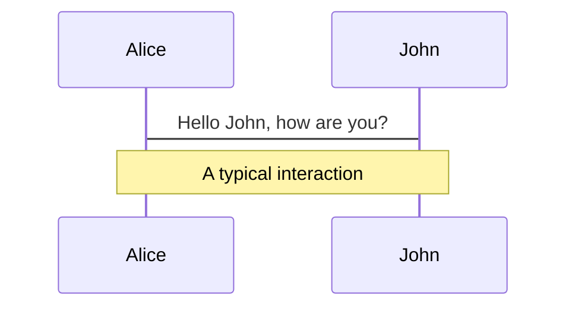

# ざっくりSlidev

---
layout: two-cols
---

# Slidevとは

* Markdownからスライド資料を作成できるプレゼンテーションフレームワーク
* NuxtLabs社の[Anthony Fu](https://antfu.me/)氏作
* 2年前ぐらいに日本でも話題に
  * [Slidevを導入してMarkdownで美しいスライドを書こう \- Qiita](https://qiita.com/loftkun/items/2fbeddc9449eb5d85dfd)
  * [Hackableなスライド作成ツールSlidevで遊ぶ](https://zenn.dev/hiroko_ino/articles/hackable-slidev-play-lt)

::right::

<div>
  
</div>

---

# NPM Trends
marp | slidev | reveal.js


---

# Slidev: Getting Started

```
$ npm init slidev@latest
```

[Demoスライド](https://demo.sli.dev/starter/)プロジェクトが生成される。

```
$ npm run dev
--> 開発用にスライドアプリを起動(ホットリロード付)

$ npm run export
--> スライドをPDFファイルとしてエクスポート (要 playwright-chromium)

$ npm run build
--> スライドをSPAとしてビルド
```

---
layout: two-cols
---

# Markdownで書ける
いろいろと

* こんな
* 感じ
* さらに

<h2>HTMLも書けて</h2>
<div class="c-orange animate-bounce">
  UnoCSSでスタイルも指定できる
</div>

```ts {2|3|7-9|12} {maxHeight:'250px'}
function add(
  a: Ref<number> | number,
  b: Ref<number> | number
) {
  return computed(() => unref(a) + unref(b))
}
/// ...as many lines as you want
const c = add(1, 2)
```

::right::

```
---
layout: two-cols
---
# Markdownで書ける
いろいろと

* こんな
* 感じ
* さらに

<h2>HTMLも書けて</h2>
<div class="c-orange animate-bounce">
  UnoCSSでスタイルも指定できる
</div>

'``ts {2|3|7-9|12} {maxHeight:'250px'}
function add(
  a: Ref<number> | number,
  b: Ref<number> | number
) {
  return computed(() => unref(a) + unref(b))
}
/// ...as many lines as you want
const c = add(1, 2)
'``
---
```

---
layout: two-cols
---

# LaTeX

$\sqrt{3x-1}+(1+x)^2$

# Diagram (mermaid)



::right::

```
# LaTeX

$\sqrt{3x-1}+(1+x)^2$

# Diagram (Mermaid)

'``mermaid
sequenceDiagram
  Alice->John: Hello John, how are you?
  Note over Alice,John: A typical interaction
'``
```

---
layout: two-cols
---
# Theme

テーマも選べて楽しさ100倍!

::right::

