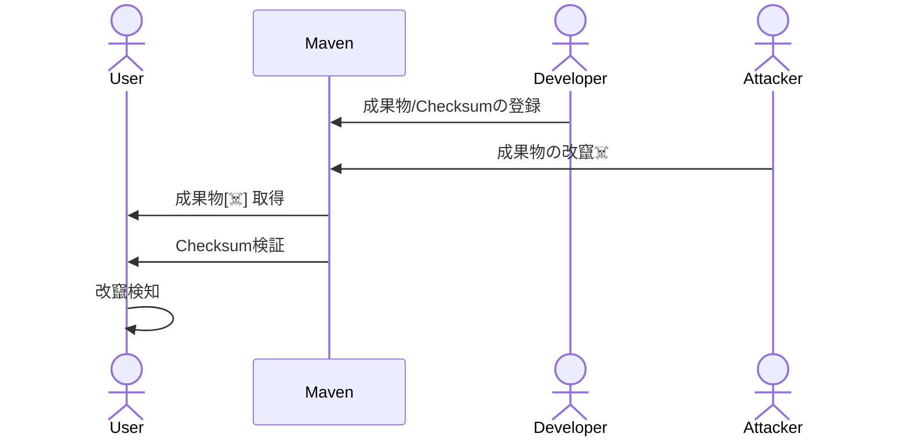
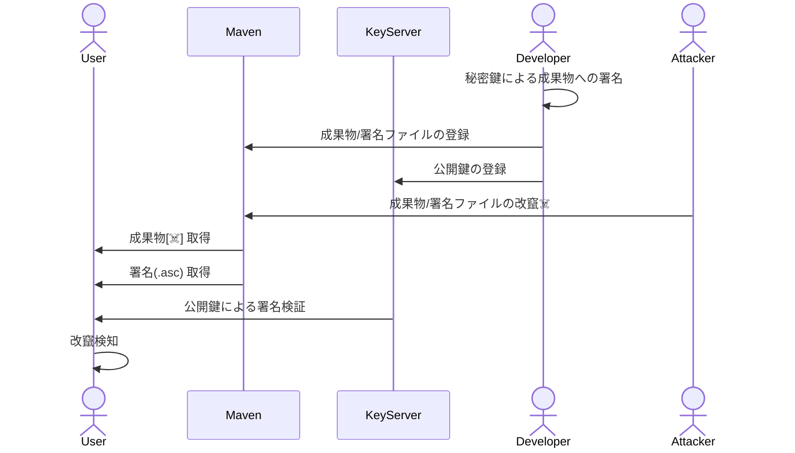

# ソフトウェア署名のこれからと今後とSigstoreと

<div class="pt-12">
  <span @click="$slidev.nav.next" class="px-2 py-1 rounded cursor-pointer" hover="bg-white bg-opacity-10">
    Press Space for next page <carbon:arrow-right class="inline"/>
  </span>
</div>

---

# はじめに

* サプライチェーンセキュリティ周りでSigstoreが話題
  * Linux Foundation傘下のOpenSSFにより進められているソフトウェア署名関連のプロジェクト
  * `Keyless Signing`技術によりソフトウェア署名用の鍵管理の手間を無くすことが出来ることがウリ
    * ソフトウェア成果物に対する署名(および検証)を推進する取り組み
    * HTTPS推進におけるLet's Encryptのような位置付け
* 自分たちで開発しているソフトウェアをセキュアにするためにすぐに使える技術ではない
  * ただし、数年後にSigstoreが普及した場合、開発に使用しているOSSの検証技術としてお世話になる可能性はある

---

# 背景

* ソフトウェアサプライチェーンにおいて、各構成物の来歴/出所(Provenance)を知ることは重要
  * **完全性**: 構成物を取得する過程において意図せぬ改竄等が行われていないか
  * **真正性**: 構成物の作者/配布者が意図したものを入手しているか
* 今までは「成果物のダイジェスト」や「成果物に対する署名」によって担保してきた

<div class="item-center self-center text-center">

</div>

---
layout: two-cols
---

# 背景
Maven Centralの例

* **XXXX.jar**: 配布物
* **XXXX.jar.md5**: 配布物のMD5 Checksum
* **XXXX.jar.sha1**: 配布物のSHA1 Checksum
* **XXXX.jar.asc**: 配布物の署名

::right::

<div class="mt-10 ml-5">
  
  <p class="text-xs text-center">図: Maven Central (log4j-core)</p>
</div>

---
layout: two-cols
---

# 背景
Checksumの検証

* **XXXX.jar**: 配布物
* <span class="text-orange-400">**XXXX.jar.md5**: 配布物のMD5 Checksum</span>
* <span class="text-orange-400">**XXXX.jar.sha1**: 配布物のSHA1 Checksum</span>
* **XXXX.jar.asc**: 配布物の署名

::right::

<div class="mt-5"></div>
```shell
$ cat log4j-core-2.21.0.jar.md5 
1024daad23bbd97c630e8df1f73cb026
$ md5sum log4j-core-2.21.0.jar
1024daad23bbd97c630e8df1f73cb026  log4j-...

$ cat log4j-core-2.21.0.jar.sha1 
122e1a9e0603cc9eae07b0846a6ff01f2454bc49
$ sha1sum log4j-core-2.21.0.jar
122e1a9e0603cc9eae07b0846a6ff01f2454bc49  log4j-...
```

<div class="mt-5 bg-gray-50">


</div>
<p class="text-xs text-center">図: Checksumによる改竄検知フロー</p>

---
layout: center
---

# 攻撃者が成果物を改竄できるならば
# 同時にChecksumも改竄できるのでは? 🤔


---
layout: two-cols
---

# 背景
GPG署名の検証

* **XXXX.jar**: 配布物
* **XXXX.jar.md5**: 配布物のMD5 Checksum
* **XXXX.jar.sha1**: 配布物のSHA1 Checksum
* <span class="text-orange-400">**XXXX.jar.asc**: 配布物の署名</span>

<hr class="mt-5"/>

攻撃者がMaven Centralの成果物と署名ファイルを改竄しても、公開鍵による検証が失敗するため、改竄を検知できる。

::right::

<div class="grid grid-cols-1 pt-4 bg-gray-50 mt-10 ml-5">


</div>
<p class="text-xs text-center">図: 署名ファイル(.asc)による改竄検知フロー</p>


---

# 背景 (Maven Central)
GPG署名の検証

1. 署名ファイル(.asc)と成果物だけでは署名の検証ができない
```shell
$ gpg --verify log4j-core-2.21.0.jar.asc log4j-core-2.21.0.jar
gpg: Signature made 2023年10月13日 00時35分31秒 JST
gpg:                using RSA key 077E8893A6DCC33DD4A4D5B256E73BA9A0B592D0
gpg: Can't check signature: No public key
```

2. Keyserver (もしくは別の場所) から署名に使った秘密鍵に対する公開鍵を取得する
```shell
$ gpg --keyserver keyserver.ubuntu.com --recv-keys 077E8893A6DCC33DD4A4D5B256E73BA9A0B592D0
gpg: key 56E73BA9A0B592D0: public key "ASF Logging Services RM <private@logging.apache.org>" imported
gpg: Total number processed: 1
gpg:               imported: 1
```

<p class="text-gray-500">※ 公開鍵が信頼できるものであるか検証する仕組みは必要...</p>

---

# 背景 (Maven Central)
GPG署名の検証

3. Step 2で公開鍵をImportしたことで署名の検証が成功する
```shell
$ gpg --verify log4j-core-2.21.0.jar.asc log4j-core-2.21.0.jar
gpg: Signature made 2023年10月13日 00時35分31秒 JST
gpg:                using RSA key 077E8893A6DCC33DD4A4D5B256E73BA9A0B592D0
gpg: Good signature from "ASF Logging Services RM <private@logging.apache.org>" [unknown]
gpg: WARNING: This key is not certified with a trusted signature!
gpg:          There is no indication that the signature belongs to the owner.
Primary key fingerprint: 077E 8893 A6DC C33D D4A4  D5B2 56E7 3BA9 A0B5 92D0
```

4. 異なるファイルでは署名の検証が失敗する
```shell
$ gpg --verify log4j-core-2.21.0.jar.asc ../trivy/trivy_0.46.0_Linux-64bit.tar.gz
gpg: Signature made 2023年10月13日 00時35分31秒 JST
gpg:                using RSA key 077E8893A6DCC33DD4A4D5B256E73BA9A0B592D0
gpg: BAD signature from "ASF Logging Services RM <private@logging.apache.org>" [unknown]
```

---
layout: two-cols
---

# 背景
署名による検証の課題

### Checksumによる検証
* 配布物の完全性を検証
* 真正性の検証は困難
  * <span class="text-red-400">配布サーバー攻撃され、配布物とChecksumを改竄されると検知不能 ☠️</span>

<div class="mt-5"></div>

### 署名による検証
* 配布物・署名ファイル・公開鍵による検証
* 配布サーバーの攻撃に耐性 (公開鍵検証)
  * 完全性・真正性の検証が可能

::right::

<div class="mt-30">
  <ul><li>Checksum生成は容易</li></ul>
</div>

<div class="mt-35">
  <ul>
    <li><span class="text-red-400">秘密鍵管理が大変 (鍵ファイル, パスフレーズ等) ☠️</span></li>
    <li><span class="text-red-400">有効期限の管理も大変 (期限切れ等の対応) ☠️</span></li>
    <li><span class="text-red-400">公開鍵の配布が面倒 ☠️</span></li>
  </ul>
</div>

---

# 背景

* ソフトウェアサプライチェーンにおいて、各構成物の来歴/出所(Provenance)を知ることは重要
  * **完全性**: 構成物を取得する過程において意図せぬ改竄等が行われていないか
  * **真正性**: 構成物の作者/配布者が意図したものを入手しているか
* 今までは「成果物のChecksum/Digest」や「成果物に対する署名」によって担保してきた

<hr class="mt-5 mb-5"/>

* <span class="text-red-400">署名による検証が堅牢だが、署名プロセスにおける鍵管理コストが高い</span>
  * → Sigstoreによるソフトウェア署名

---

# Sigstore?

* ソフトウェア成果物に対する署名・検証・保護を提供する標準規格及びサービス
* Linux Foundation傘下のOpenSSFにより主導されているプロジェクト
  * 2021/03: Red Hat, Google, Purdue University主導でスタート
  * 2022/10: General Availability (v1.0) リリース
* 以下の3つのツール/サービスによりKeyless Signingを実現する
  * `Cosign`: ソフトウェア成果物やOCIイメージの署名及び検証を行うクライアントツール
    * Flucioと連携することでKeyless Siginingを実現可能
  * `Fulcio`: **OIDCからのユーザー情報を元に署名用の短命の証明書を発行する認証局**
  * `Rekor`: 署名プロセスの透明性を担保するために、証明書発行・署名等の情報やメタデータを保管するサービス (Transparency Logs)

---
layout: two-cols
---

# Sigstore?
Sigstoreによる署名/検証フロー

#### SigstoreによるKeyless Signing


::right::

<div class="mt-22">

#### Sigstoreによる署名検証

<p class="text-xs">参考: <a href="https://www.cybertrust.co.jp/blog/oss-security/sigstore-code-signing.html">Sigstore で OSS コード署名｜BLOG｜ サイバートラスト</a></p>
</div>

---

# Sigstore?
メリット

| | 完全性 | 真正性 | 開発者コスト | サービス依存度 |
|:-|:-|:-|:-|:-|
| Checksum         | ✅ | ❌ | ✅ | ✅ |
| GPG等の鍵による署名 | ✅ | ✅ | ❌ | ▲ |
| Sigstoreによるkeyless signing | ✅ | ✅ |✅ | ❌ |

<hr class="mt-5 mb-5"/>

* SigstoreによるKeyless Signingにより、ソフトウェア署名の仕組みを少ない労力で導入できるようになった
* ただし、Sigstore関連の様々なサービス (`Fulcio`, `Rekor`等)に依存することになる
  * 開発者のコストを受け持つサービスが現れたという解釈もできる

---

# Sigstore
Sigstoreの実世界での利用例

* `Cosign`によるソフトウェア署名
* `Cosign`によるDocker/OCI Imageの署名
* `npm provenance`コマンド

---

# Cosignによる署名
Blobファイル (sign-blob/verify-blob)

```shell {1-2|3|7-11|12-13}
$ cosign generate-key-pair
# ==> `cosign.key`(秘密鍵), `cosign.pub`(公開鍵)
$ cosign sign-blob --key cosign.key ./log4j-core-2.21.0.jar
Using payload from: ../log4j/log4j-core-2.21.0.jar
Enter password for private key: 

    The sigstore service, hosted by sigstore a Series of LF Projects...
    (意訳: 署名プロセスに関する情報が、PublicなTransparency Logsに削除不能な形で保存されるから送信情報に含まれるデータに注意な)

By typing 'y', you attest that (1) you are not submitting the personal data of any other person; and (2) you understand and agree to the statement and the Agreement terms at the URLs listed above.
Are you sure you would like to continue? [y/N] y
tlog entry created with index: 50905245
MEQCIH/9Fu2Nvx/LA0rIFLf4a+UdgGkGTeRcWBtPTxvZ77lNAiANC5fjf0fBiRMjtNIKLzPRXNGnWYRpWwOwldx3l0yBRA==
```

---

# Cosignによる署名
Blobファイル (sign-blob/verify-blob)


---

# Cosignによる署名
Blobファイル (sign-blob/verify-blob)

```shell {15-17}
$ cosign generate-key-pair
# ==> `cosign.key`(秘密鍵), `cosign.pub`(公開鍵)
$ cosign sign-blob --key cosign.key ./log4j-core-2.21.0.jar
Using payload from: ../log4j/log4j-core-2.21.0.jar
Enter password for private key: 

    The sigstore service, hosted by sigstore a Series of LF Projects...
    (意訳: 署名プロセスに関する情報が、PublicなTransparency Logsに削除不能な形で保存されるから送信情報に含まれるデータに注意な)

By typing 'y', you attest that (1) you are not submitting the personal data of any other person; and (2) you understand and agree to the statement and the Agreement terms at the URLs listed above.
Are you sure you would like to continue? [y/N] y
tlog entry created with index: 50905245
MEQCIH/9Fu2Nvx/LA0rIFLf4a+UdgGkGTeRcWBtPTxvZ77lNAiANC5fjf0fBiRMjtNIKLzPRXNGnWYRpWwOwldx3l0yBRA==

# 署名検証
$ cosign verify-blob --key cosign.pub --signature MEQCIH/9Fu2Nvx... ./log4j-core-2.21.0.jar
Verified OK
```


---

# Cosignによる署名
Docker/OCI Imageのkeyless signing

```shell {1-2|3-4|6-9|10-13}
# GitHub Container Registryのイメージに署名
$ cosign sign ghcr.io/kaakaa/nginx@sha256:6b06964cdbbc517102ce5e0cef95152f3c6a7ef703e4057cb574539de91f72e6
Generating ephemeral keys...
Retrieving signed certificate...

    The sigstore service, hosted by sigstore a Series of LF Projects...
    (意訳: 署名プロセスに関する情報が、PublicなTransparency Logsに削除不能な形で保存されるから送信情報に含まれるデータに注意な)

Are you sure you would like to continue? [y/N] y
error opening browser: exit status 3
Go to the following link in a browser:
	 https://oauth2.sigstore.dev/auth/auth?access_type=online&client_id=sigstore&code_challenge=...
   # Microsoft, Google, GitHubのいずれかで認証 (次ページ)
Enter verification code: xxxxxxxxxxxxxxxxxxxxxxxxx

Successfully verified SCT...
tlog entry created with index: 12345678
Pushing signature to: ghcr.io/kaakaa/nginx
```

---
layout: two-cols
---
# Cosignによる署名
OCI Image


::right::

<div class="mt-22">
  
</div>

---

# Cosignによる署名
Docker/OCI Imageのkeyless signing

```shell {14|16-18}
# GitHub Container Registryのイメージに署名
$ cosign sign ghcr.io/kaakaa/nginx@sha256:6b06964cdbbc517102ce5e0cef95152f3c6a7ef703e4057cb574539de91f72e6
Generating ephemeral keys...
Retrieving signed certificate...

    The sigstore service, hosted by sigstore a Series of LF Projects...
    (意訳: 後から削除できないPublicなTransparency Logsに保存されるから送信情報に含まれるデータに注意な)

Are you sure you would like to continue? [y/N] y
error opening browser: exit status 3
Go to the following link in a browser:
	 https://oauth2.sigstore.dev/auth/auth?access_type=online&client_id=sigstore&code_challenge=...
   # Microsoft, Google, GitHubのいずれかで認証 (次ページ)
Enter verification code: xxxxxxxxxxxxxxxxxxxxxxxxx

Successfully verified SCT...               # SCT = Signed Certificate Timestamp
tlog entry created with index: 12345678    # Rekorに格納されたTransparency LogのID
Pushing signature to: ghcr.io/kaakaa/nginx # 署名情報はOCI Registryに格納される(次ページ参照)
```

---
layout: two-cols
---

# Cosignによる署名
Docker/OCI Imageのkeyless signing

* 署名情報がOCI RegistryにOCI Artifactとして登録
  * tag: `sha256-${IMAGE_DIGEST}.sig`

<span class="text-xs">参考: [GitHub Actions で distroless イメージのコンテナ署名を検証する](https://tech.isid.co.jp/entry/verify-distroless-signature-using-cosign-on-github-actions)</span>

* RekorにTransparency Logが追加される
  * [Rekor Search](https://search.sigstore.dev/?logIndex=47494349)

::right::

<div class="mt-2">
  
  
</div>


---

# Cosignによる署名
Docker/OCI Imageのkeyless signing

`cosign sign-blob`と`cosign sign`でtlogの公開鍵部分が異なる

<div>
  
  <p class="text-xs">図: tlog比較 (左:sign-blob / 右:sign)</p>
</div>

---

# Cosignによる署名
Docker/OCI Imageのkeyless signing


```shell　{1-4|7-11|15-16}
$ cosign verify \
    --certificate-oidc-issuer https://github.com/login/oauth \  # 署名に使ったIDP
    --certificate-identity stooner.hoe@gmail.com  \             # 署名者のOIDCアカウント
    ghcr.io/kaakaa/nginx@sha256:6b06964cdbbc517102ce5e0cef95152f3c6a7ef703e4057cb574539de91f72e6

Verification for ghcr.io/kaakaa/nginx@sha256:6b06964cdbbc517102ce5e0cef95152f3c6a7ef703e4057cb574539de91f72e6 --
# OCI Registryに格納された署名情報が正しいこと(改竄されていないこと)を検証
The following checks were performed on each of these signatures:
  - The cosign claims were validated
  - Existence of the claims in the transparency log was verified offline
  - The code-signing certificate was verified using trusted certificate authority certificates
[{
  "critical":{
    "identity":{"docker-reference":"ghcr.io/kaakaa/nginx"},
    # 注意: 検証済みの署名情報に格納されたImage Digestと手元のOCI Imageが同一であることを追加で検証する必要がある
    "image":{"docker-manifest-digest":"sha256:6b06964cdbbc517102ce5e0cef95152f3c6a7ef703e4057cb574539de91f72e6"},
    "type":"cosign container image signature"
  },
  ...
}]
```

---
layout: two-cols
---

# npm provenance
NPMモジュールの来歴情報登録

* 2023/09/26 にGAとなった`npm`の機能   
  * 2023/09/26: [npm provenance general availability \- The GitHub Blog](https://github.blog/changelog/2023-09-26-npm-provenance-general-availability/)
  * (2023/04/19: [Public Beta](https://github.blog/changelog/2023-04-19-npm-provenance-public-beta/))

<hr class="mt-5 mb-5"/>

```shell {lines:false}
$ npm publish --provenance
```

**npm publish**コマンドでパッケージを公開する際にSigstoreによる署名プロセスを実行するオプション。  
GitHub Actions等のCIと連携することで、ソースコード/ビルドの情報も併せて公開することができる。

**→ ソフトウェアを検証するための情報(署名情報)だけでなく、<span class="text-orange-400">成果物を生成するプロセス(ソース/ビルド情報)</span>の情報も公開することができる。**

::right::
<div class="mt-10 ml-5">
  
  <p class="text-right text-xs">参考: <a href="https://github.blog/jp/2023-04-26-introducing-npm-package-provenance/">npmパッケージプロベナンスを導入 - GitHubブログ</a></p>
  
  <p class="text-right text-xs">参考: <a href="https://www.npmjs.com/package/slidev-addon-rabbit">slidev-addon-rabbit - npm</a></p>
</div>

---

# npm provenance
NPMモジュールの来歴情報登録

```yaml {all|4,6,15}
publish-npm:
  needs: build
  runs-on: ubuntu-latest
  permissions:
    contents: read
    id-token: write   # Sigstoreによる署名のために必要
  steps:
    - uses: actions/checkout@v3
    - uses: actions/setup-node@v3
      with:
        node-version: '18.x'
        registry-url: https://registry.npmjs.org/
    - run: npm install -g npm
    - run: npm ci
    - run: npm publish --provenance --access public  # provenanceオプションをつけて実行するだけ
      env:
        NODE_AUTH_TOKEN: ${{secrets.npm_token}}
```


Sigstoreにより数行の記述追加のみでソフトウェア署名が実演可能になった。  
ただし、アカウント管理の重要性は増大。  
<span class="text-xs">ref: <a href="https://github.blog/2022-02-01-top-100-npm-package-maintainers-require-2fa-additional-security/">Top-100 npm package maintainers now require 2FA, and additional security-focused improvements to npm - The GitHub Blog (2022/2/1)</a></span>
* [Top\-100 npm package maintainers now require 2FA, and additional security\-focused improvements to npm \- The GitHub Blog](https://github.blog/2022-02-01-top-100-npm-package-maintainers-require-2fa-additional-security/) (2022/02/01)


---

## Wrap up

* Sigstoreによりソフトウェア署名における鍵管理の必要性を排除可能になる
  * OIDC Tokenベースとなるため、CI等への組み込みが非常に容易となる(gh action/npm provenance等)
    * 現状、npmが先行しているが、各パッケージマネージャーも何かしらの対応はしてきそう
  * OSS開発者がソフトウェア署名を導入しやすくなり、社会全体としてのセキュリティ底上げが期待される
    * HTTPS推進におけるLet's Encryptのような存在
* 個人管理の鍵ファイルから、SaaS(Fulcio, Rekor)依存で、信頼性が向上するかはユースケース次第
  * 「署名を実施されたこと」自体を公開したくない場合(BtoB等)は、Public SaaSを利用できない
    * [Fulcio](https://github.com/sigstore/fulcio), [Rekor](https://github.com/sigstore/rekor)はOSSで開発されているが、これらをセルフホストするなら鍵共有の方が楽そう

## 感想
* 即効性のあるセキュリティ対策ではないが、業界全体の動向としては押さえて方が良さそう
  * npmなどは何も考えず `--provenance` オプション指定で良い気がする
  * OSS利用者側(検証側)としてどう動けばいいかはまだよくわかっていない
* 各Registryごとに異なっていた署名管理/検証プロセスがcosignを通じて統一されると嬉しい(のかな?)

---

# 参考

* Sigstoreを使うと安全なんですか？
  * [sigstoreのKeyless Signingでは何を検証しているのか \- sometimes I laugh](https://sil.hatenablog.com/entry/sigstore-keyless-signing-what-to-verify)
* OCIイメージに格納される署名はどんな情報なんですか?
  * [GitHub Actions で distroless イメージのコンテナ署名を検証する \- ISID テックブログ](https://tech.isid.co.jp/entry/verify-distroless-signature-using-cosign-on-github-actions)

