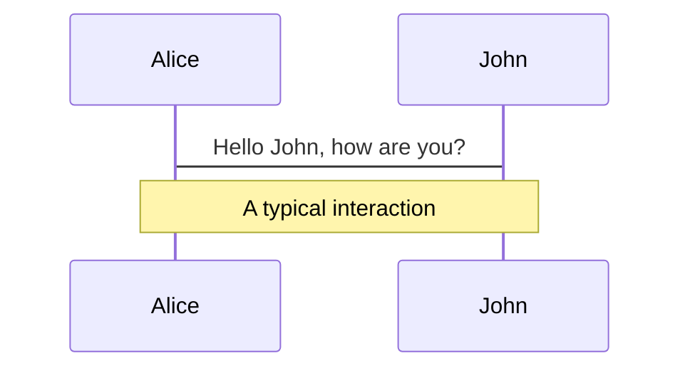

# <logos-slidev class="animate-bounce"/> Slidev?

---
layout: iframe-right
url: https://sli.dev/
---

# <logos-slidev/> Slidevとは

* Markdownからスライド資料を作成できる<br>Dev向けプレゼンテーションフレームワーク
* 2021年ぐらい?に日本でも話題に
  * <span class="text-xs">[Slidevを導入してMarkdownで美しいスライドを書こう \- Qiita](https://qiita.com/loftkun/items/2fbeddc9449eb5d85dfd)</span>
  * <span class="text-xs">[Hackableなスライド作成ツールSlidevで遊ぶ](https://zenn.dev/hiroko_ino/articles/hackable-slidev-play-lt)</span>
* 作者はNuxtLabs社の[Anthony Fu](https://antfu.me/)氏
  * <span class="text-xs">最近人気の[Vitest](https://github.com/vitest-dev/vitest)の作者でもある</span>


<p class="text-xs text-right c-gray"><a href="https://2023.stateofjs.com/en-US/libraries/#tier_list">ref: State of JavaScript 2023: Libraries</a></p>

---
layout: two-cols
---

# NPM Trends
Marp | Slidev | Reveal.js | MDX Deck | Spectacle

* DL数は<span class="text-red-500">Reveal.js</span>が圧倒的
* <span class="text-green-400">MDX Deck</span>は2019年ごろ盛り上がったが開発停止
* <logos-slidev/> <span class="text-orange-500">Slidev</span>と<span class="text-blue-500">Marp</span>は(だいたい)同じような傾向
* <span class="text-yellow-400">Spectacle</span>は古くから細く長く使われ続けている

<div class="mt-26">
</div>

* Start数も<span class="text-red-500">Reveal.js</span>が多いが、<logos-slidev/> <span class="text-orange-500">Slidev</span>も約半数
* <logos-slidev/> <span class="text-orange-500">Slidev</span>が一番若いプロジェクト
* <span class="text-blue-500">Marp</span>は各サブプロジェクトに分散<br><span class="text-sm"><span class="text-gray-400">灰字</span>は **marp-team/marp**のもの</span>

::right::

<div class="margin-right: 5px">


</div>

---
layout: two-cols
---

# Slidev: Getting Started

```
$ npm init slidev@latest
```

[Demoスライド](https://demo.sli.dev/starter/)プロジェクトが生成される。

```
$ npm run dev
--> 開発用にスライドアプリを起動(ホットリロード付)

$ npm run export
--> スライドをPDFファイルとしてエクスポート (要 playwright-chromium)

$ npm run build
--> スライドをSPAとしてビルド
```

::right::

<div class="ml-5">


</div>

---
layout: two-cols
---


# Markdown(+α)で書ける
いろいろと

* こんな感じに
* 書けて

<div class="mt-15px"/>

<h3>HTMLも書けて</h3>
<div class="c-orange animate-bounce">UnoCSSでスタイルも指定できる</div>

<div class="mt-35px"/>

<mdi-lightbulb class="c-yellow"/> Syntax Highlightも高機能

<div class="mt-10px"/>

```js {monaco-run} {autorun:false}
console.log(`Writable/runnable highlight by Monaco`)
```

<div class="mt-30px"/>

````md magic-move
```js
const str = JSON.stringify(json)
console.log("Shiki Magic Move: ", str)
```
```js
console.log(`Shiki Magic Move: ${JSON.stringify(json)}`)
```
````

::right::

<div class="ml-5">

```
---
layout: two-cols
---
# Markdown(+α)で書ける
いろいろと

* こんな感じに
* 書けて

<h3>HTMLも書けて</h3>
<div class="c-orange animate-bounce">UnoCSSでスタイルも指定できる</div>

<mdi-lightbulb class="c-yellow"/> Syntax Highlightも高機能

``'js {monaco-run} {autorun:false}
console.log(`Writable/runnable highlight by Monaco`)
``'

<!-- since v0.48.0 -->
``'`md magic-move
``'js
const str = JSON.stringify(json)
console.log("Shiki Magic Move: ", str)
``'
``'js
console.log(`Shiki Magic Move: ${JSON.stringify(json)}`)
``'
``'`
---
```

</div>

---
layout: two-cols
dragPos:
  logo: 85,426,70,69
---

# Markdown(+α)で書ける
いろいろと

#### LaTeX
$\sqrt{3x-1}+(1+x)^2$

#### Diagram (mermaid)


#### Draggable Object (since v0.49.0)


::right::

```
---
layout: two-cols
dragPos:
  logo: 84,447,70,69,0
  #   : Left,Top,Width,Height,Rotate
---
# Markdown(+α)で書ける
いろいろと

### LaTeX
$\sqrt{3x-1}+(1+x)^2$

### Diagram (Mermaid)
``'mermaid {scale:0.5}
sequenceDiagram
  Alice->John: Hello John, how are you?
  Note over Alice,John: A typical interaction
``'

#### Draggable Object (since v0.49.0)


```
